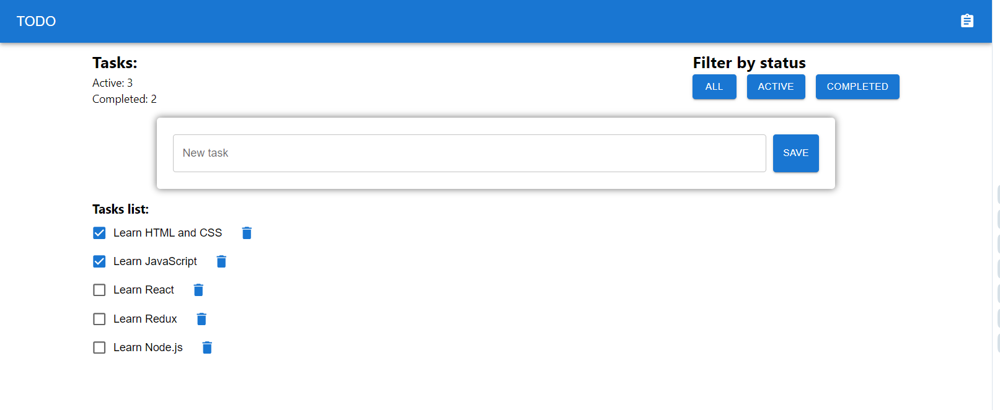

<h1 align="center">
   
  
   
ToDo list
   
</h1>

# ToDo list

Create a component that meets the requirements below.

- Adding a new record.
- A new record is added if its length is less than or equal to N characters.
- Display a list of added records.
- Switching the status of a record Completed / Not completed when clicking on its name.
- Filtering by type (all, completed, current).
- Display counter of completed and uncompleted tasks.
- Use a storage (Redux).
- For styling you can use any lib/framework, but remember UI matters.
- Please use this linter https://github.com/wemake-services/wemake-frontend-styleguide.

[Link to site](https://svitlanaparyiska.github.io/to-do-list/ 'ToDo list')

